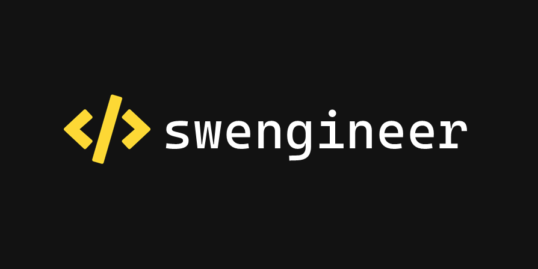

# swengineer

## Prerequisites

-   [Node.js](https://nodejs.org/en/)
-   [pnpm](https://pnpm.io/)

```bash
npm install -g pnpm
```

## Installation

```bash
pnpm install
```

## Build

### Configuration

Copy the example configuration under [`server/.env.example`](server/.env.example) and rename it to [`server/.env`](server/.env).

Local configurations can be created by naming the file `.env.NODE_ENV.local` where `NODE_ENV` is the environment variable. E.g. `.env.development.local`.

### Development

```bash
pnpm start
```

Uses files created for build under [`client/src/`](client/src/). Hosted at http://localhost:3000/ by default.

#### Debug

```bash
pnpm dev
```

### Production

```bash
pnpm build
```

Uses files created for build under [`client/build/`](client/build/). Hosted at http://localhost:8080/ by default.

## Run

```bash
pnpm start
```

## Test

```
pnpm test
```

### Coverage

```bash
pnpm coverage
```

Client coverage report is generated under [`client/coverage/`](client/coverage/).
Server coverage report is generated under [`server/coverage/`](server/coverage/).
